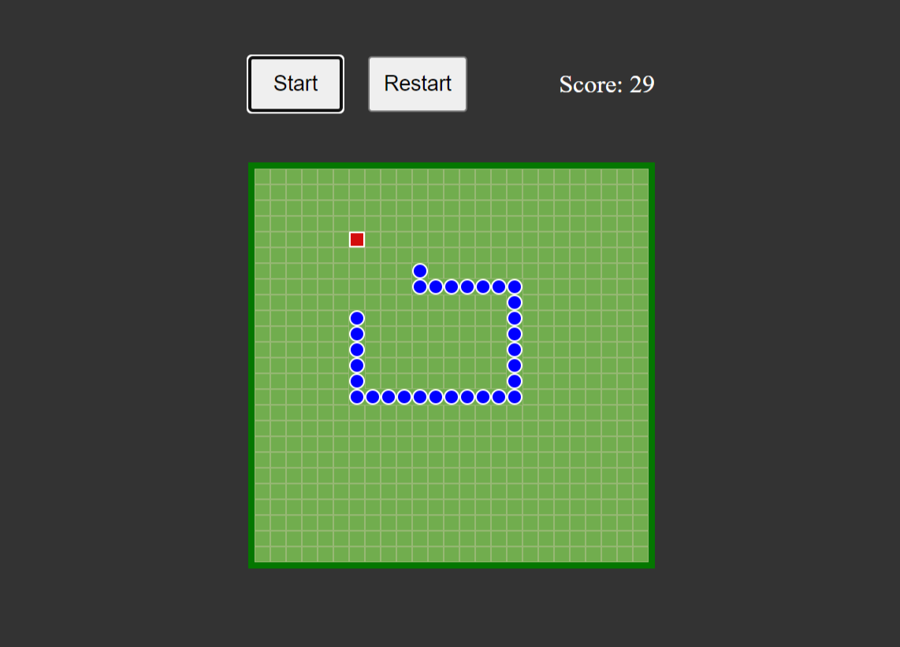

# Snake Game

Un clásico juego de la serpiente desarrollado en JavaScript y HTML. ¡Juega y demuestra tus habilidades para esquivar obstáculos y comer comida!

## Demo

Puedes jugar al juego en línea en el siguiente enlace: [Jugar al Snake](https://snake-react-chi.vercel.app/)

## Características

- Controla la serpiente utilizando las teclas de flecha (↑, ↓, ←, →).
- Recoge la comida para aumentar tu puntuación y hacer crecer a la serpiente.
- Evita chocar contra las paredes o a ti mismo, ¡eso terminará el juego!
- Visualización de la puntuación actual.
- Interfaz de usuario sencilla y fácil de usar.

## Cómo jugar

1. Abre el juego en tu navegador web.
2. Utiliza las teclas de flecha para mover la serpiente en la dirección deseada.
3. Intenta comer la comida para aumentar tu puntuación y hacer crecer a la serpiente.
4. Evita chocar contra las paredes y a ti mismo.
5. ¡Diviértete y compite por la puntuación más alta!

## Contribuir

Si deseas contribuir a este proyecto, no dudes en abrir una solicitud de extracción (pull request) con tus mejoras o correcciones. Apreciamos tu ayuda para hacer que este juego sea aún mejor.

## Desarrollo

Este juego de la serpiente se desarrolló utilizando tecnologías web estándar, incluyendo HTML, CSS y JavaScript. Puedes explorar el código fuente en el repositorio de GitHub.

## Licencia

Este juego de la serpiente se distribuye bajo la licencia MIT. Siéntete libre de utilizar, modificar y compartir este juego de acuerdo con los términos de la licencia.

---

¡Diviértete jugando al Snake Game y buena suerte!
